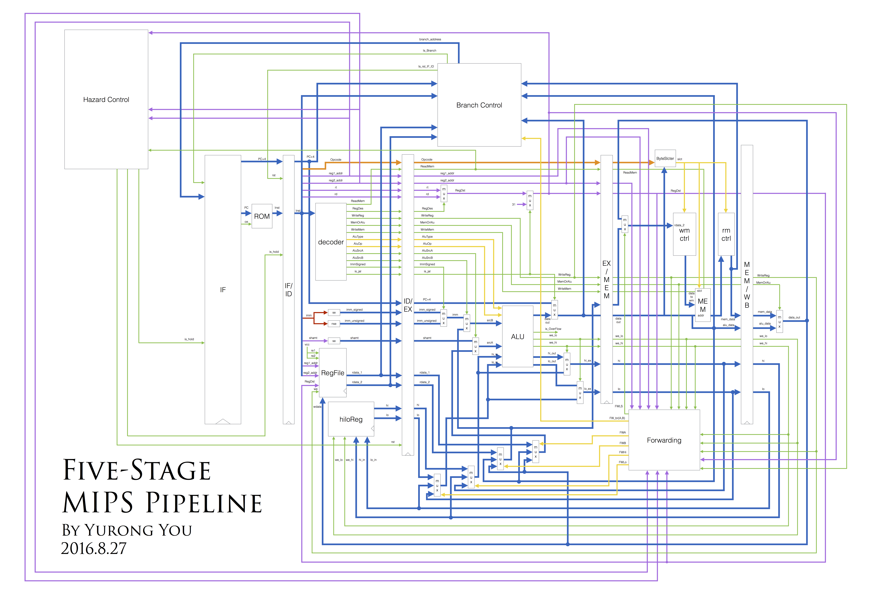

# MIPS_CPU
Implement a CPU which supports a subset of MIPS operations using Verilog HDL

	

The pipeline supports all MIPS standard integer instructions except those related to coprocessors, and the forwarding, hazard control and branch control techniques are all fully implemented. Project report is available [here](./doc/Five-Stage%20MIPS%20Pipeline%20in%20Verilog%20HDL.pdf).

## Status
1. finish construction
	* [x] `decoder.v`
	* [x]  `BranchControl.v`
	* [x]  `HazardControl.v`
	* [x]  `RM_ctrl.v`
	* [x]  `WM_ctrl.v`
	* [x]  solve div function
2. fully review the pipeline code
3. test
	* [x] write virtual memory, rom
	* test on instrctions
		* [x] ori
		* [x] arithmetic operations
		* [x] memory store/load
		* [x] logic operations
		* [x] bitwise operations
		* [x] hi/lo operations
		* [x] dependency test (forwarding)
		* [x] jump operations
		* [x] overall test
4. optional improvement
	* add cache
	* implement CP0
5. report
	* clearly outline the supported instructions

